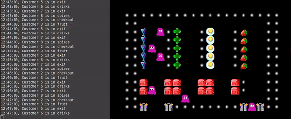

# Markov Simulation
In this project, we wrote a program that simulates customer behaviour. We were given the data with the tracked movements of all customers in a supermarket during a five-day week indicating where customers spent their time. We first did EDA on the data and calculated transition probabilities. Then we implemented a Customer and a Supermarket classes and ran a ***Monte-Carlo-Markov-Chain*** simulation for multiple customers for a single day using the generated transition probabilities matrix. Following a sample solution, we created a visualization of the customers behavior in the supermarket.

